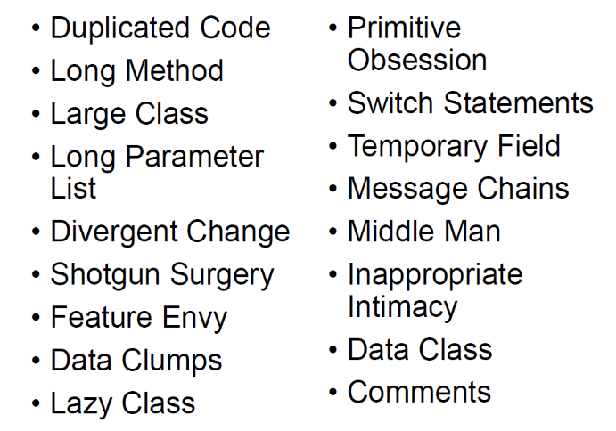
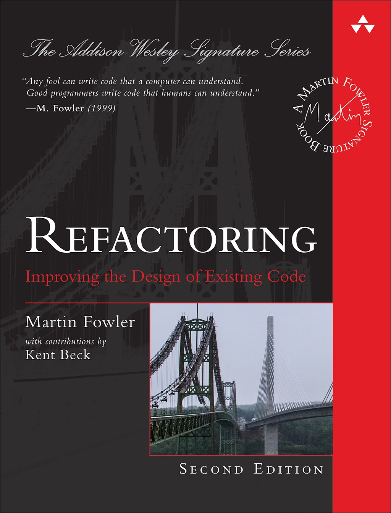
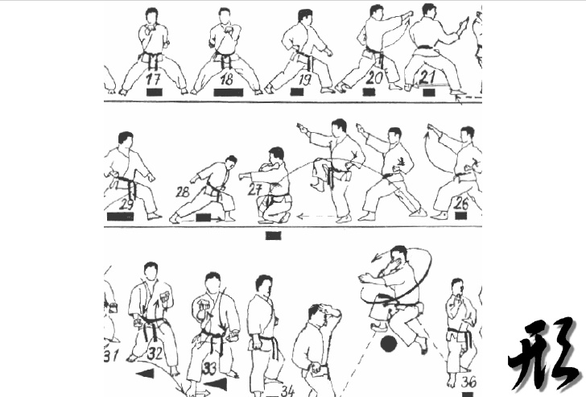

# @color[IndianRed](Death) from a thousand @color[GoldenRod](cuts)
The victim is your code and the murder 
weapon is the Primitive Obsession

---
# Who am I?

  
- declared @color[GoldenRod](developer) ;-)
- enthusiastic technical @color[GoldenRod](trainer/coach)
- wannabe @color[GoldenRod](entrepreneur)

---

## Code Smells

---

## Primitive Obsession
using @color[IndianRed](primitive data types) 
to represent @color[GoldenRod](domain knowledge)

---

## Common Examples
- double for @color[GoldenRod](money)
- int for @color[GoldenRod](quantity)
- dates for @color[GoldenRod](reservation)

---

## Refactoring Legacy Code Workshop

---

## After many workshops
My conclusion is that the Primitive Obsession 
is the @color[GoldenRod](basis) of almost all other smells

---

## how to @color[GoldenRod](remove) it?

---

## @color[GoldenRod](treatment)
### introduce many small objects 
### that performs small tasks

---

## @color[GoldenRod](strategy)
### embrace continuous incremental design

---

## @color[GoldenRod](tool)
### use refactoring techniques

---

## @color[GoldenRod](Payoff)
- More understandable code
- Better code organization
- Composable building block
- Powerful behavior attractors
- Eliminating knowledge duplication

---

# LIVE @color[GoldenRod](DEMO)

---

## how to learn to quickly 
## @color[GoldenRod](spot) and @color[IndianRed](solve)
## Primitive Obsessions?

---

## how to become a 
## @color[GoldenRod](Better Developer)?

---

## through the study

---

## @color[GoldenRod](sure) but...

---

## the best way is 
## by doing a @color[GoldenRod](lot of practice)
## period

---

## doing your job every day
## @color[IndianRed](doesn’t qualify) as real practice

--- 

## Deliberate Practice
### The secret is life-long period of @color[IndianRed](deliberate effort)
### to @color[GoldenRod](improve performance) in a specific domain

---

## We need a @color[GoldenRod](place) and @color[GoldenRod](time)
## to @color[IndianRed](experiment) and @color[IndianRed](fail)
## spectacularly

---

## This workshop is that @color[GoldenRod](place)

---

## Code Kata

---

## Mindset
### @color[GoldenRod](You are here to learn)
### not to build something
### no output required

---

## Mindset
### Slow down. Don't focus on getting it done, @color[GoldenRod](focus on doing it perfectly)

---

## Mindset
### It's necessary to @color[GoldenRod](push to the extreme) to verify the validity of a technique

---

## Mindset
### Leverage each @color[GoldenRod](other knowledge). Work in pair.

---

## Let's code!

---

## Today Code Kata

Task List an example of code obsessed with primitives

https://bit.ly/2Na9oh8