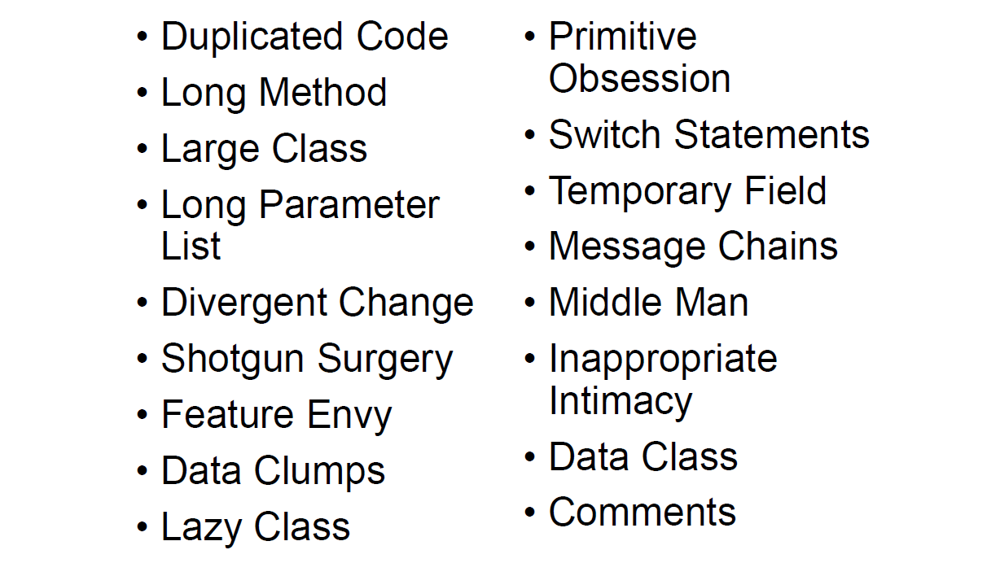
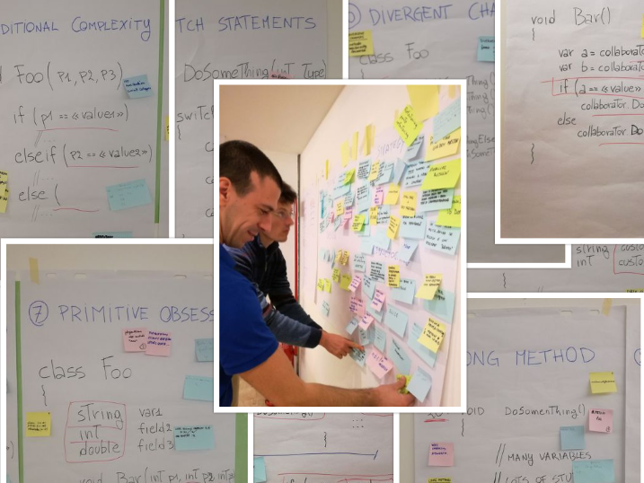

## Death from a thousand wounds
The victim is your code and the murder weapon is the Primitive Obsession
<!-- 
# @color[GoldenRod](foo)
# @color[IndianRed](bar)
 -->

+++
# Who am I?

  
- declared @color[GoldenRod](developer) ;-)
- enthusiastic technical @color[GoldenRod](trainer/coach)
- wannabe @color[GoldenRod](entrepreneur)

+++

## Code Smells

+++

## Primitive Obsession
using primitive data types to represent domain knowledge

+++

## Examples
- double for money
- int for quantity
- ints/dates for range
- array for object

+++

## Refactoring Legacy Code Workshop

+++

## Primitive Obsession is the basis of almost all other smells

+++

## how to remove it?

+++

## introduce many small objects, called ValueObject, that performs small tasks as treatment

+++

## emergent/continuous design as long term strategy

+++

## use the refactoring techniques as tool

+++

## benefits
- More flexible code
- Better understandability and organization of code
- Less duplicate code

+++

# DEMO (invoice pay terms)